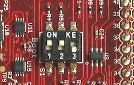
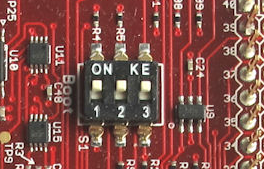

Dual Motor Torque Control
=========================

Control torque (or actually current) of two motors at once, using MotorWare.

This program can be used with the Universal Dual Motor GUI.

Hardware
--------

This project is configured for use with the LAUNCHXL-F28069M microcontroller
board and two DRV8305 booster packs.

Requirements and Paths
----------------------

Requires the following additional repositories:

  * [amd_motorware_ext](https://github.com/open-dynamic-robot-initiative/amd_motorware_ext)
  * [user_config_f28069m_drv8305](https://github.com/open-dynamic-robot-initiative/user_config_f28069m_drv8305)

Further Texas Instrument's [MotorWare](https://www.ti.com/tool/MOTORWARE)
library is needed.  There are modifications that have to be made to the original
MotorWare in order to build this project.  See the instructions on how to apply
them, see the README of
[amd_motorware_ext](https://github.com/open-dynamic-robot-initiative/amd_motorware_ext).

By default, it is expected that all packages are in separate subdirectories of
the same root directory.  So your workspace structure should look like this:

    workspace
    ├── amd_motorware_ext
    ├── mw_dual_motor_torque_ctrl
    ├── motorware
    └── user_config_f28069m_drv8305

In case you cannot follow this structure for some reason, you can modify the
path variables `$MW_INSTALL_DIR` and `$USER_CONFIG_DIR` in the project settings
of `mw_dual_motor_torque_ctrl`.

### Code Composer Studio

To build the firmware and to flash it to the boards, you need Texas Instruments'
[Code Composer Studio](http://www.ti.com/tool/ccstudio) (CCS).  These
instructions are tested with version 9.1.0 but other versions may work as well.

When installing it, make sure the following components are selected:

* **Processor Support**: C2000 32-bit Real-time MCUs
* **Debug Probes**: TI XDS

When starting CCS for the first time, you have to specify a workspace location.
Note that this "CCS workspace" is just where CCS stores its configuration and is
not related to the workspace directory that is described above (i.e. the CCS
workspace doesn't need to be in this directory).

Build Instructions
------------------

### Import in Code Composer Studio

Start Code Composer Studio and import the `mw_dual_motor_torque_ctrl` project
via the menu

    Project > Import CCS Projects...

In the import dialogue, set the search-directory to the one of the
`mw_dual_motor_torque_ctrl` package.The Discovered projects pane should then
show `dual_motor_torque_ctrl`.

**Make sure the "Copy projects into workspace" option is _not_ set.**

After importing, the project should show up in the _Project Explorer_.

### Build and Run in Debug Mode

You can run the firmware in debug mode while the board is connected to the
computer via USB.  This is mostly useful for development.

Note: When using a TI LaunchPad board, make sure the boot switches are set such
that jTag is enabled (see [below](#launchpad-boot-switches)).

1. Compile your code, using the "Release" build.
2. Make sure the board is powered and connected via USB to the PC. All three
   boot switche have to be in the upper position (see below).
3. Start the Debugger by clicking on the bug icon in the tool bar: 
4. Enable Silicon Real-time Mode by clicking the corresponding button in the
   tool bar: 
5. Run the code by pressing the Resume button: 
   Now you can use a GUIComposer GUI or modify variables on the board via the
   _Expressions View_.
6. To quit the debugger, press the Terminate button: 
   Note: This will only detach the debugger, it will not stop the program on the
   board!

With this procedure, the program is not permanently stored on the board. That
means all steps have to be repeated, everytime the board is restarted.

### Build and Write to Flash

To have the program written to flash rather than RAM (so that it is permanently
stored on the board), simply switch the build type from "Release" to "Flash".

Now compile and write the program to the board by running the debugger (same
procedure like described above, only use "Flash" instead of "Release" build).
You can use the debugger to run and monitor the program just like before.

Note that when using the TI LaunchPad, you have to set the boot switches on the
board to the right configuration so that the firmware is automatically loaded
from flash when restarting the board (see next section).

LaunchPad Boot Switches
-----------------------

_This only applies to the TI LaunchPad board._

After the program is written to the flash memory with the steps described above,
the boot settings have to be changed to tell the board to run the code in the
flash rather than using the USB connection.

Change the switches on the board (hidden under the J1 BoosterPack...) to 1: Up,
2: Up, 3: Down.

Now the board should automatically run the program from flash when powered. Note
that connection via USB is not possible in this configuration (i.e. to use the
debugger or update the program you have to set the switches back to Up/Up/Up
again).

| Run firmware from flash | Use jTag (to debug via USB) |
| ----------------------- | --------------------------- |
|  |  |

Structure of this Package
-------------------------

This package is structured as follows:

  * src: Contains all the source code of this project
  * ccs: Contains the Code Composer Studio project files

License
-------

BSD 3-Clause License

Copyright (c) 2019, Max Planck Gesellschaft, New York University
